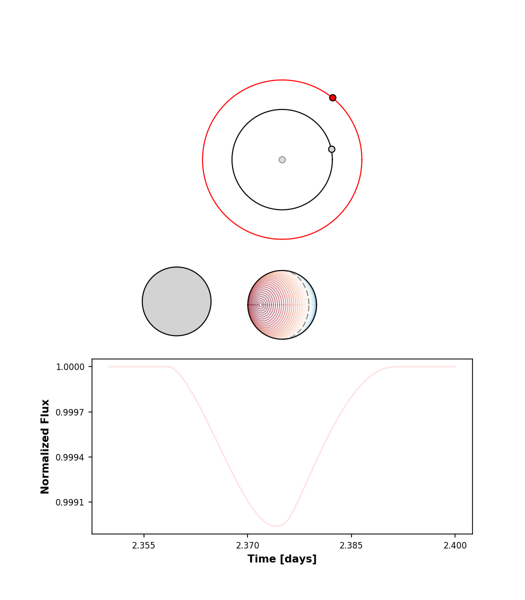
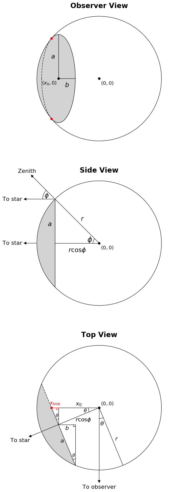
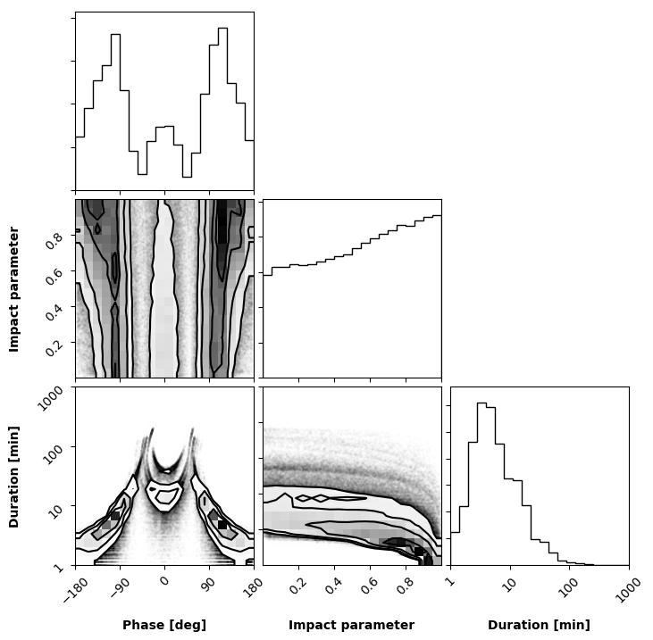
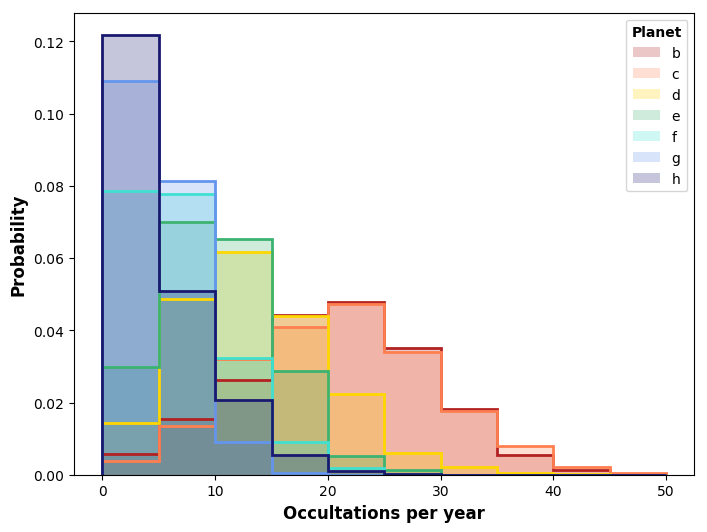
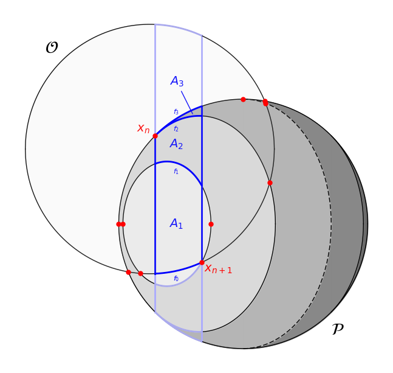
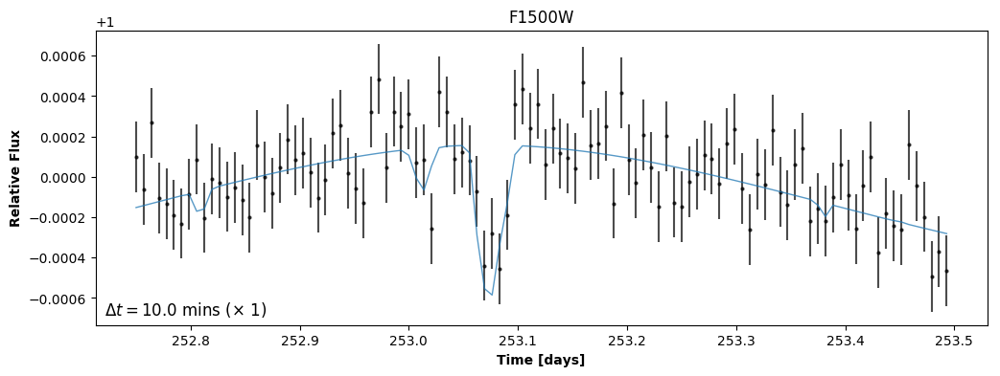
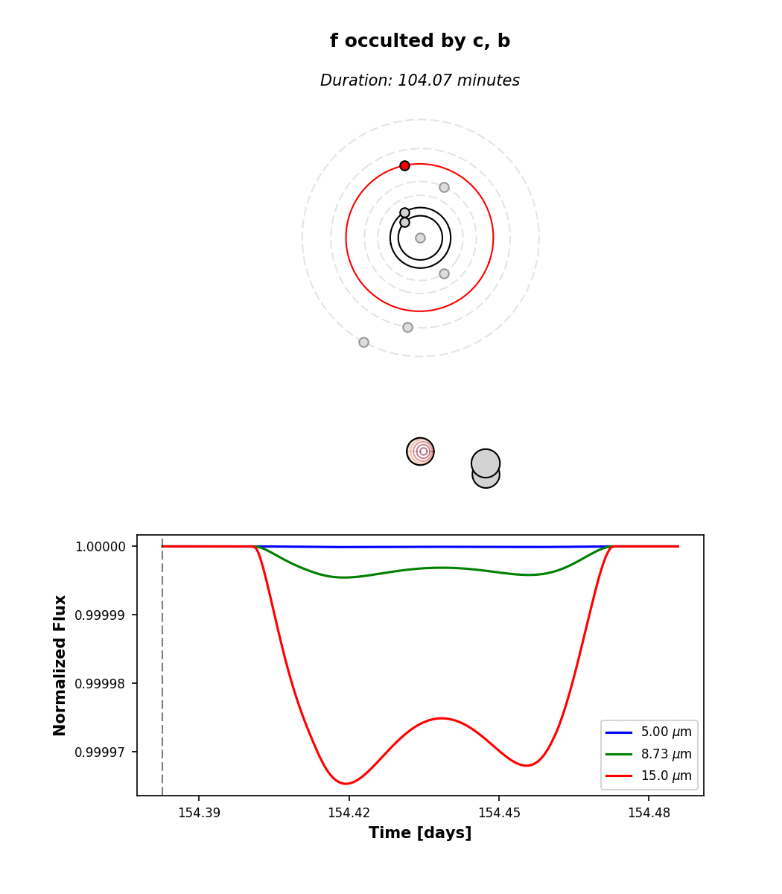
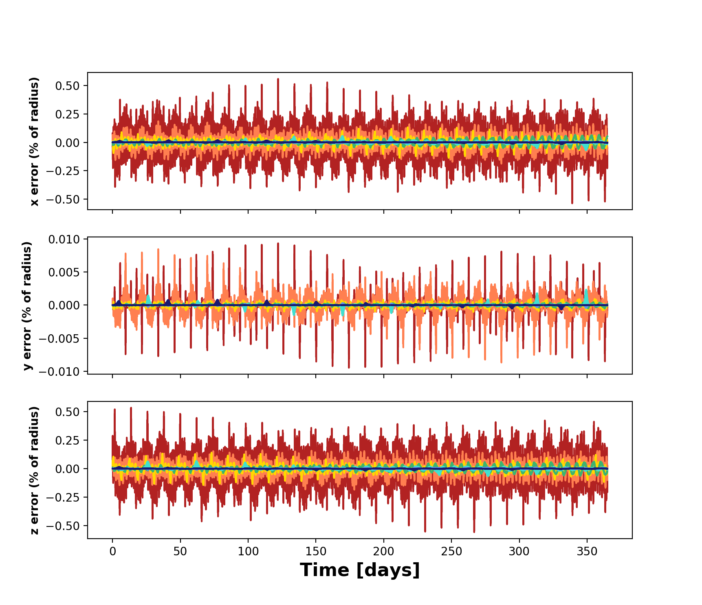
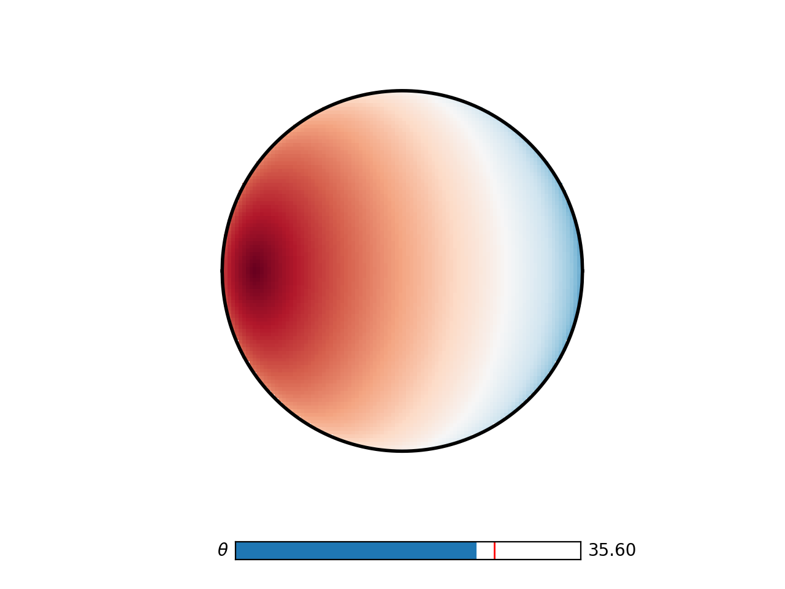

# scripts

## daynight

Plots an occultation event in two different limits: the airless limit
and the thick atmosphere limit. The asymmetry of the light curve in the 
former case betrays a strong day/night temperature contrast on the occulted
planet.

## flower

Computes and plots a hypothetical mutual transit among four planets with 
longitudes of ascending node at right angles to each other:

## geometry

Plots the geometry of the ellipses of constant zenith angle used
to compute the occultation light curves of airless planets.

## hist

Histograms of the occultation events as a function of phase, duration, and
impact parameter for each of the seven TRAPPIST-1 planets.

## integration

Plots a diagram showing how the occultation integration scheme works.

## jwst_example

Simulate an observation of a triple occultation of TRAPPIST-1 **c** by **b**
with JWST MIRI at 15 microns.

## lightcurve

Computes a light curve of the TRAPPIST-1 system over ten days, with
orbital parameters drawn at random from their prior distributions.
All transits, secondary eclipses, planet-planet occultations, and mutual
transits are shown. Click on an individual event to see it in detail.
Then click anywhere in the pop-up window to animate the event.

## mutual_occultation

An actual mutual planet-planet occultation in Trappist-1!

## mutual_transit

Computes and plots a hypothetical mutual transit event, where two large 
planets transit the star and occult each other simultaneously:

## next_occultation

Compute the time of the next occultation of a given planet
and plot the light curve.

## Omega_from_mutual_transit

For random draws from the prior, computes the duration of a
mutual transit between TRAPPIST-1 b and c as a function of the
difference in their longitude of ascending nodes. With some
scatter, the difference in this angle is inversely proportional
to the duration of the mutual transit. Observing such an event
can place strong constraints on the longitudes of ascending node
of the TRAPPIST-1 planets.

## orbits

Plots the orbital path of each of the seven TRAPPIST-1 planets as seen
by an observer on Earth. The width of each path is the planet diameter.
Planet-planet occultations may occur anywhere where two orbits cross.

## oversample

Tests the oversampling functionality of the code. Oversampling the transit/occultation 
is necessary when the exposure time is a non-negligible fraction of the event duration.

## scatter

Computes all occultations that occur in the TRAPPIST-1 system over a 
3 year time period for a random draw from the prior. Plots each
occultation as a circle in a top-view of the system; the circle size, 
transparency, and color indicate the duration, impact parameter, and 
occulting body, respectively.

## timestep

Tests the minimum timestep we need in the N-body code.
We integrate for one year and look at the errors as a fraction
of the planet radius. Looks like a timestep of 1 hour leads to
negligible (< 1 percent) error over 1 year.

## zenith

Plots an interactive heatmap of the zenith angle for a given point on a sphere
oriented at an angle `theta` away from the observer. This is used
to calculate the radiance map of occulted planets.

