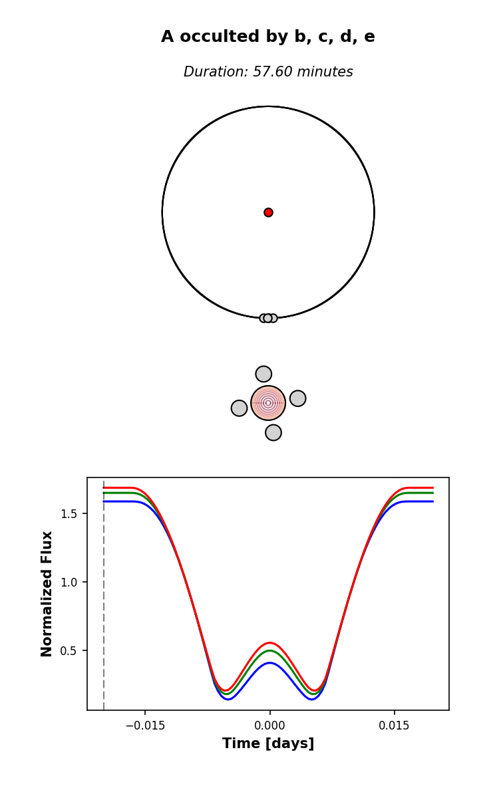
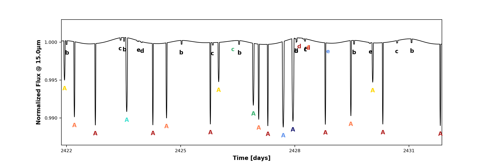
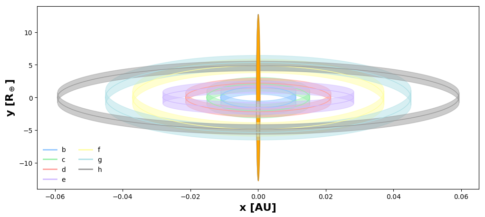
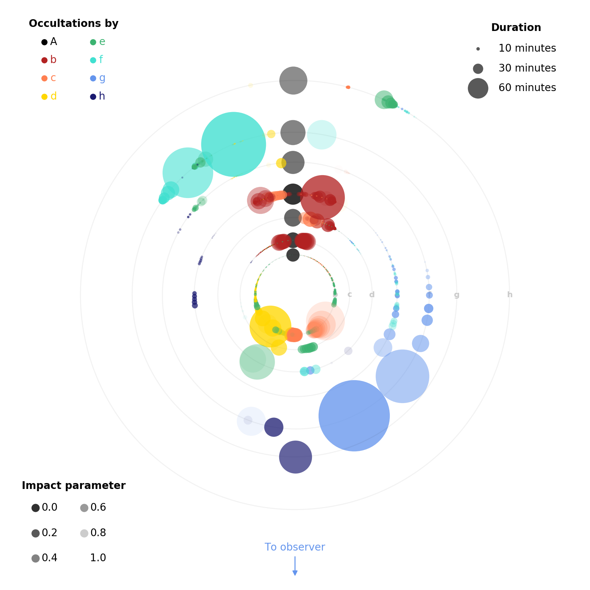

# scripts

## flower

Computes and plots a hypothetical mutual transit among four planets with 
longitudes of ascending node at right angles to each other:

## hist

_Coming soon_

## lightcurve

Computes a light curve of the TRAPPIST-1 system over ten days, with
orbital parameters drawn at random from their prior distributions.
All transits, secondary eclipses, planet-planet occultations, and mutual
transits are shown. Click on an individual event to see it in detail.
Then click anywhere in the pop-up window to animate the event.

## mutual_transit

Computes and plots a hypothetical mutual transit event, where two large 
planets transit the star and occult each other simultaneously:

## Omega_from_mutual_transit

For random draws from the prior, computes the duration of a
mutual transit between TRAPPIST-1 b and c as a function of the
difference in their longitude of ascending nodes. With some
scatter, the difference in this angle is inversely proportional
to the duration of the mutual transit. Observing such an event
can place strong constraints on the longitudes of ascending node
of the TRAPPIST-1 planets.

## orbits

Plots the orbital path of each of the seven TRAPPIST-1 planets as seen
by an observer on Earth. The width of each path is the planet diameter.
Planet-planet occultations may occur anywhere where two orbits cross.

## scatter

Computes all occultations that occur in the TRAPPIST-1 system over a 
3 year time period for a random draw from the prior. Plots each
occultation as a circle in a top-view of the system; the circle size, 
transparency, and color indicate the duration, impact parameter, and 
occulting body, respectively.

## spectrum

Computes and plots a light curve of the TRAPPIST-1 system over three days in the
wavelength range 5-15 microns, with orbital parameters drawn at random 
from their prior distributions. All transits, secondary eclipses, 
planet-planet occultations, and mutual transits are shown.

